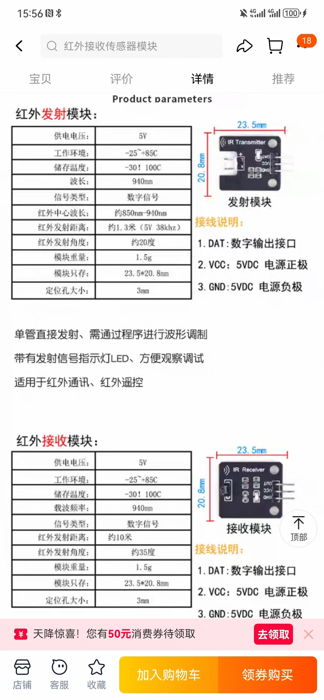
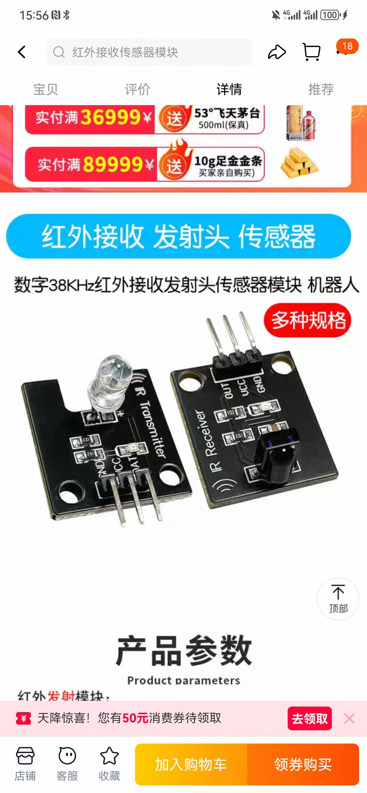

# pi5-ir38k-tools

这是一个基于 Raspberry Pi 5 的 38kHz 红外收发示例。本仓库提供硬件连接图以及 Python 示例代码，演示如何使用 `lgpio` 库发送和接收红外信号。

## 准备工作

1. 安装 `lgpio`：`sudo apt install python3-lgpio`
2. 将红外发射管连接到 GPIO18，红外接收头连接到 GPIO23，具体接线可参考下图。
3. 脚本会为接收引脚启用内部下拉电阻，未接线时也能保持低电平。




## 运行示例

在连接好硬件后，可分别运行发射和接收脚本，并使用 `--pin` 参数指定 GPIO：

```bash
sudo python3 ir_send.py --pin 18    # 发送38kHz脉冲，默认使用GPIO18
sudo python3 ir_recv.py --pin 23    # 等待接收信号，默认使用GPIO23
```

两个脚本配合使用可测试硬件连线是否正确。


## 学习与回放遥控码

若要控制空调等设备，可以先记录遥控器发出的红外脉冲，再重新发送这些脉冲。

```bash
sudo python3 ir_record.py --pin 23 --timeout 2 > code.txt  # 记录按键脉冲
sudo python3 ir_play.py --pin 18 "$(cat code.txt)"          # 重放记录的脉冲
```

`ir_record.py` 会输出逗号分隔的脉冲时长（微秒），`ir_play.py` 按顺序重新播放这些脉冲，从而模拟遥控器发送信号。
